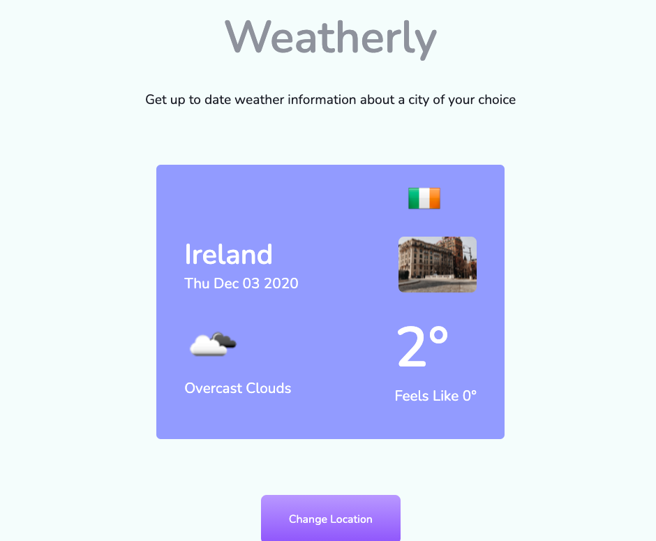

# Weatherly


> Weatherly is a application that fetches data from the Openweather API and displays the information about the current weather in any of the world's major cities.





[Live Demo](https://raw.githack.com/Maryjanee/Weatherly/app/dist/index.html).

## Built With

- HTML
- SCSS
- Javascript
- Openweather Api
- Unsplash Api
- CountryFlags Api
- Webpack 5.4


### Prerequisites

- npm  6.14.8
- Webpack 5.4


### Setup

1. Clone this repository by using the Terminal to navigate to the desired location on your computer and then enter the following line of code into the Terminal:
```
git@github.com:Maryjanee/Weatherly.git
```
2. Run `cd Weatherly` to move inside the downloaded repository.

3. The project contains a `package.json` file the manages its dependencies.Install them by running the command `npm install`.

4.Also run `npm run-script build` and `npm start` to view the project in a web browser.


 Author

👤 **Maryjane Akpagbue**

- Github: [Maryjanee](https://github.com/Maryjanee)
- Twitter: [Maryjane Akpagbue](https://twitter.com/alfredmaryjane)
- Linkedin: [Maryjane Akpagbue](https://www.linkedin.com/in/maryjane-akpagbue)


## Contributing

- To contribute to this project:
- Fork this repository & clone locally.
- Create an upstream remote and sync your local copy.
- create a new branch.
- Push your code to your origin repository.
- Create a new Pull Request .


## Show your support

Give a ⭐️ if you like this project!

## Acknowledgments

- Microverse